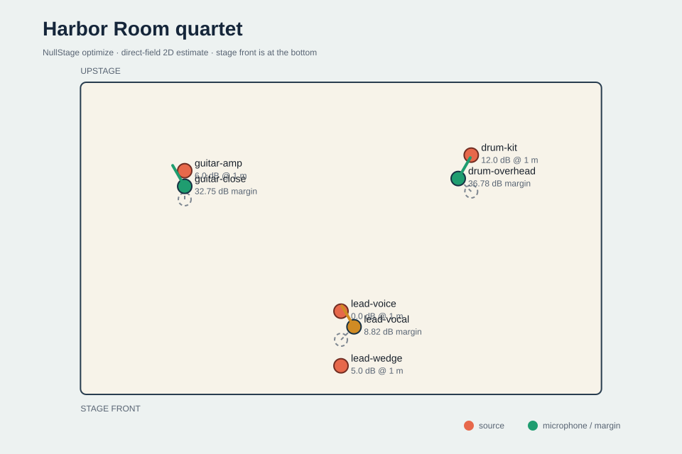

# NullStage

**排练前，先把麦克风的“安静方向”对准真正需要拒绝的声源。**

NullStage 是一个完全离线的舞台麦克风串音几何预检工具。输入实测的二维舞台、各声源相对电平、麦克风位置与指向性，以及允许移动/旋转的真实范围；它会计算每支麦克风的目标声与合并串音余量，并在明确边界内穷举一个可审计的候选布置。

[English](README.md) · [模型与公式](docs/model.md) · [竞品调研](docs/research.md) · [失败修复](docs/troubleshooting.md) · [打开离线演示报告](docs/demo/report.html)



## 一分钟验收

需要 Python 3.11–3.14 和 [`uv`](https://docs.astral.sh/uv/)：

```powershell
git clone https://github.com/KanadeK/nullstage.git
cd nullstage
uv sync --dev --locked
uv run --no-sync nullstage optimize examples/live-band.json `
  --output-dir out/live-band `
  --fail-below-db 8
```

正式示例会对三支麦克风分别评估 50–65 个有效候选。v0.1.0 的最差目标声/串音余量由 `5.66 dB` 提升至 `8.82 dB`，并严格遵守：

- 最大移动半径与位置步长；
- 最大转角与角度步长；
- 麦克风到目标声源的最小/最大工作距离；
- 用户声明的离轴抑制下限，不把理论零点当成无限安静。

输出包含 `report.json`、`stage.svg`、无脚本 `report.html` 和终端摘要。原始位置永远是候选之一，所以优化不会降低余量。

## 三种明确结果

```powershell
# 只分析原布局
uv run --no-sync nullstage analyze examples/live-band.json

# 搜索允许范围并输出证据包
uv run --no-sync nullstage optimize examples/live-band.json --output-dir out/optimized

# 有效报告，但低于 8 dB，预期退出 1
uv run --no-sync nullstage analyze examples/crowded-rehearsal.json --fail-below-db 8

# 引用了不存在的目标声源，预期退出 2
uv run --no-sync nullstage analyze examples/invalid-unknown-target.json
```

| 退出码 | 含义 |
|---:|---|
| `0` | 输入有效，并满足可选阈值 |
| `1` | 输入和报告都有效，但至少一支麦克风低于阈值 |
| `2` | JSON、输出路径、搜索规模或 I/O 无效；按终端修复提示处理 |

NullStage 不覆盖已有输出目录，避免误操作破坏先前证据。

## 这不是房间声学模拟器

模型只计算二维直达声：相对 1 m 声源电平、距离衰减、理想一阶指向性（受声明的离轴下限约束）、串音功率合并，最后得到“目标声 - 合并串音”。

它不计算反射、房间模态、相位、障碍、频率响应、近讲效应、演出中的移动、反馈或绝对 SPL。因此结果是值得现场试听和测量的候选，不是音质或安全保证。

## 完整开发验收

```powershell
uv sync --dev --locked
uv run --no-sync python scripts/check.py
```

门禁覆盖格式、静态检查、严格类型、分支覆盖率、成功/阈值失败/非法输入示例、确定性报告、wheel/sdist 内容、隔离安装和已安装 CLI 的 0/1/2 行为。

MIT 许可。项目不内置厂商麦克风数据库或商标数据。
